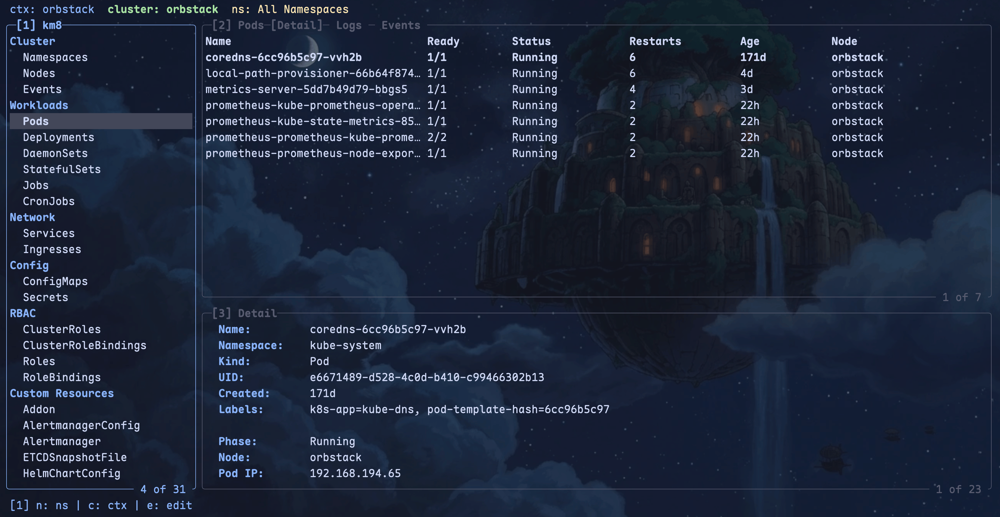

# km8 — KubeMate

<p align="center">
  
</p>

[](https://github.com/vulcanshen/km8/releases)
[](https://go.dev/)
[](https://goreportcard.com/report/github.com/vulcanshen/km8)
[](LICENSE)
[](https://collabnix.github.io/kubetools/#cluster-with-core-cli-tools)

A terminal UI for Kubernetes, inspired by [Lens IDE](https://k8slens.dev/), [lazygit](https://github.com/jesseduffield/lazygit), [lazydocker](https://github.com/jesseduffield/lazydocker), and [k9s](https://github.com/derailed/k9s). Built with Go and [Bubble Tea](https://github.com/charmbracelet/bubbletea).



## Features

- **17 built-in resource types + CRD support** -- dynamic discovery of Custom Resources at startup
- **Real-time Watch updates** -- resources refresh automatically via Kubernetes Watch API
- **Vim-style navigation** -- `j`/`k`, `u`/`d` page scroll, `gg`/`G`, `/` search
- **3-panel lazygit-style layout** -- numbered sidebar, list, and detail panels with scroll indicator
- **Drill-down navigation** -- Deployment → Pods → Containers
- **Pod log streaming** -- multi-container support with `<container>|<log>` format
- **Container shell exec** -- `kubectl exec` into any container
- **kubectl edit integration** -- opens `$EDITOR` for in-place resource editing
- **Resource deletion** -- `D` with confirmation dialog
- **Search/filter** -- `/` to search in all three panels
- **Namespace and context switching** -- `n` / `c`
- **Detail tabs** -- Detail / Events / Logs (Logs tab only for Pods)
- **Panel expand** -- `+`/`-` to toggle full screen
- **Theme system** -- drop a `theme.yaml` into config directory to override colors
- **Help & App Log overlays** -- `?` / `!` popup on top of main UI
- **Error notifications** -- status bar badge + status line message
- **Crash logging** -- panics written to the km8 log directory
- **Audit logging** -- every `kubectl edit` and `kubectl delete` recorded to `audit-*.log`

## Installation

### Quick Install (macOS/Linux)

```bash
curl -fsSL https://raw.githubusercontent.com/vulcanshen/km8/main/install.sh | sh
```

### Quick Install (Windows PowerShell)

```powershell
irm https://raw.githubusercontent.com/vulcanshen/km8/main/install.ps1 | iex
```

### Homebrew (macOS/Linux)

```bash
brew install vulcanshen/tap/km8
```

### Scoop (Windows)

```powershell
scoop bucket add vulcanshen https://github.com/vulcanshen/scoop-bucket
scoop install km8
```

### From source

```bash
go install github.com/vulcanshen/km8/cmd@latest
```

### Uninstall

```bash
# macOS/Linux
curl -fsSL https://raw.githubusercontent.com/vulcanshen/km8/main/uninstall.sh | sh

# Windows PowerShell
irm https://raw.githubusercontent.com/vulcanshen/km8/main/uninstall.ps1 | iex
```

### Build locally

```bash
git clone https://github.com/vulcanshen/km8.git
cd km8
go build -o km8 ./cmd/
./km8
```

## Quick Start

```bash
km8
```

Connects to your current kubeconfig context. Use `n` to switch namespaces, `c` to switch contexts.

## Key Bindings

### Navigation

| Key | Action |
|---|---|
| `j` / `k` | Move cursor up / down |
| `u` / `d` | Page up / down |
| `gg` / `G` | Jump to top / bottom |
| `1` / `2` / `3` | Switch panel |
| `Tab` | Cycle panels |

### Table (Panel 2)

| Key | Action |
|---|---|
| `/` | Search / filter |
| `Enter` | Drill down |
| `e` | Edit resource (kubectl edit) |
| `D` | Delete resource |
| `s` | Shell into container |

### Detail (Panel 3)

| Key | Action |
|---|---|
| `h` / `l` | Switch tab |
| `+` / `-` | Expand / restore panel |

### Global

| Key | Action |
|---|---|
| `n` | Switch namespace |
| `c` | Switch context |
| `!` | App log |
| `?` | Toggle help |
| `q` / `Esc` | Quit / back |

## Configuration

Config files are in the OS-appropriate config directory. Set `XDG_CONFIG_HOME` to override on any platform:

| OS | Default Path |
|---|---|
| Linux | `$XDG_CONFIG_HOME/km8/` or `~/.config/km8/` |
| macOS | `~/Library/Application Support/km8/` |
| Windows | `%APPDATA%/km8/` |

Logs (crash and audit) are written to the `logs/` subdirectory of the config directory.

### config.yaml

```yaml
default_context: ""      # kubeconfig context (default: current-context)
default_namespace: ""    # namespace filter (default: all namespaces)
editor: ""               # editor override (default: $VISUAL → $EDITOR → vi)
```

### theme.yaml

Drop a `theme.yaml` to customize colors. Only override what you need -- unspecified fields keep defaults.

```yaml
sidebar:
  background: ""           # empty = terminal transparent
  foreground: "#cdd6f4"
  selected_bg: "#45475a"
  selected_fg: "#cdd6f4"
  category_fg: "#89b4fa"

table:
  header_bg: "#313244"
  header_fg: "#89b4fa"
  row_fg: "#cdd6f4"
  selected_row_bg: "#45475a"
  selected_row_fg: "#cdd6f4"
  alternating_bg: ""

detail:
  border_color: "#585b70"
  label_fg: "#89b4fa"
  value_fg: "#cdd6f4"
  tab_active_bg: "#45475a"
  tab_active_fg: "#cdd6f4"
  tab_inactive_fg: "#6c7086"

status_bar:
  background: "#181825"
  foreground: "#cdd6f4"
  cluster_fg: "#a6e3a1"
  namespace_fg: "#f9e2af"
  context_fg: "#89b4fa"

status_line:
  background: "#313244"
  foreground: "#a6adc8"

status:
  running: "#a6e3a1"
  pending: "#f9e2af"
  error: "#f38ba8"
  unknown: "#6c7086"
```

## Requirements

- **kubectl** on `$PATH` (for edit, delete, and shell exec)
- A valid **kubeconfig** (`~/.kube/config` or `$KUBECONFIG`)
- A running Kubernetes cluster

## License

[GPL-3.0](LICENSE)
